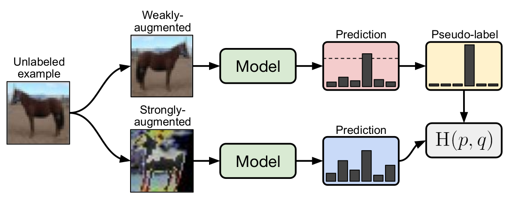

```diff
- IMPORTANT NOTE
```
* To complete this practical, you need to have the [provided checkpoint](https://drive.google.com/file/d/19yHOS6vp6YeCygFRL1Wz-9XC31oB67D-/view?usp=sharing) in the `checkpoints/checkpoint-20000.npy` path. There are a few lines of code for downloaing it and moving it automatically. Also there are some tests for you to make sure it has been done correctly.

* If you want to run this code on Google Colab, it is easier to first create an empty notebook connect it to your drive and then use `git clone`.


# FixMatch: Simplifying Semi-Supervised Learning with Consistency and Confidence
In this practical, we are going to focus on semi-supervised learning, which refers to the situation of using unlabeled data to enhance the performance of models on a classification task. The method we are focusing on, is called FixMatch [1] which has simplified the process of semi-supervised learning compared to the recent state-of-the-art methods.
The idea of semi-supervised learning is based on the fact that often unlabeled data can be obtained quite easily, and used in many situations where labelling is costly. The recent literature, however, presents semi-supervised learning using complicated methods. [1] proposes a method, called FixMatch, to simplify the complexity of the process by using a simple pipeline shown below, which uses the model predictions on weakly augmented images, as pseudo-labels.



It is note worthy that, if we use the output of the model to train itself, then we are doing something called self-training. In self training, we use model to produce some labels to train on, and the labels are called pseudo labels.

The summary of FixMatch's method is that, besides the simple supervised loss, we also have an unsupervised loss, which utilize weak and strong image augmentation strategies. By adding an unsupervised loss to the total loss, we force the model to produce the same output for strongly augmented image, as for the weakly augmented one. There is a condition for using unsupervised loss, however, ensuring the model is "confident enough" about its prediction for the weakly augmented image to be considered as a pseudo-label.
As before, the supervised loss is a simple cross-entropy loss, and unsupervised loss is a cross-entropy after masking low-confidence predictions.
Our model, finally, uses its own confident-enough predictions as pseudo-labels and considers them as training samples to learn from. 

# References
[1] Sohn, Kihyuk, et al. "Fixmatch: Simplifying semi-supervised learning with consistency and confidence." Advances in neural information processing systems 33 (2020): 596-608.
